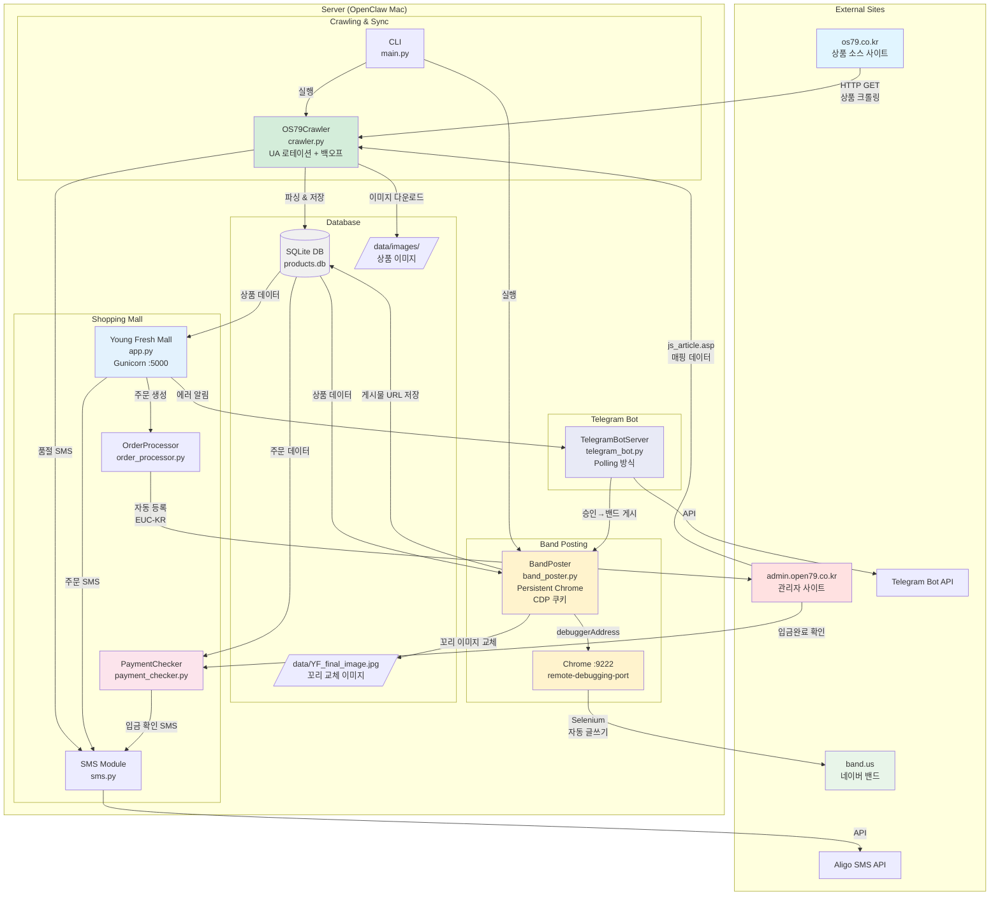
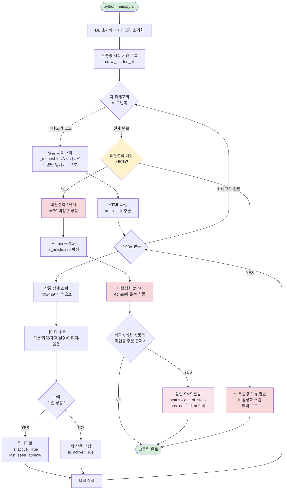
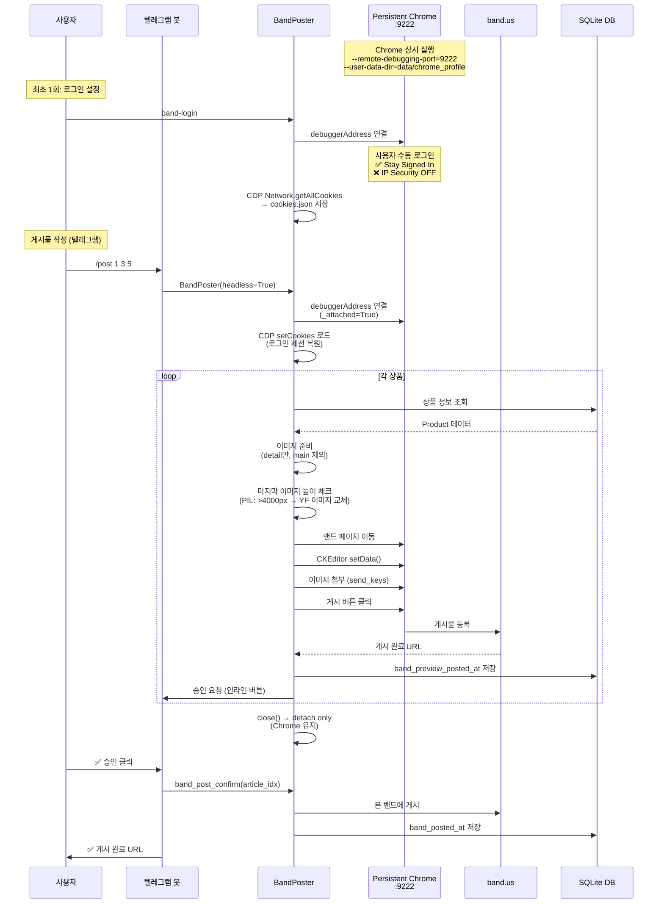
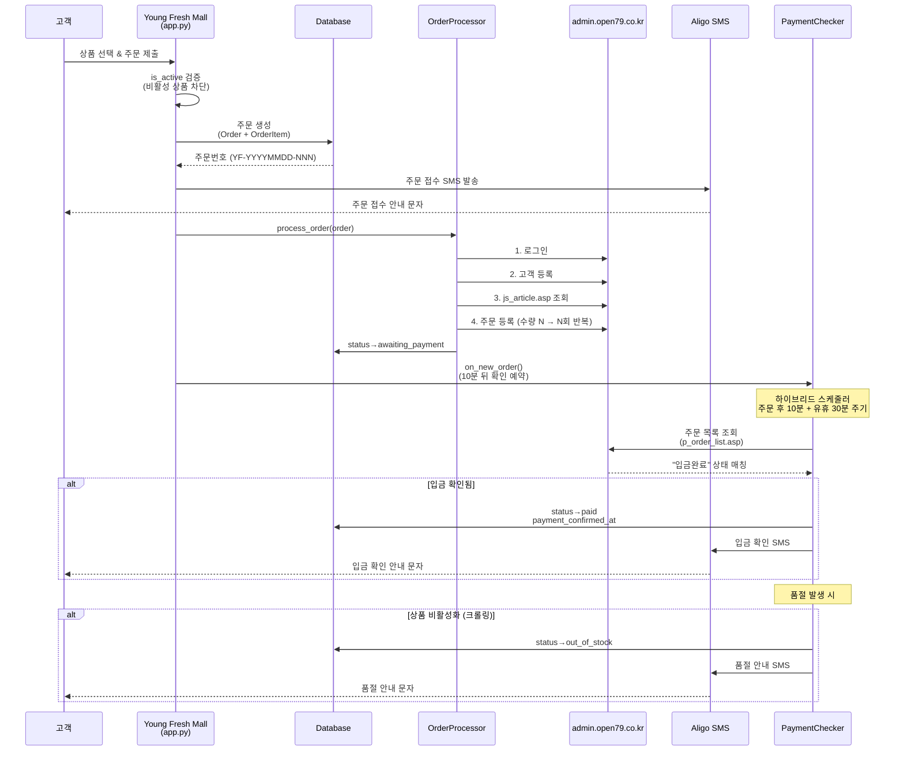
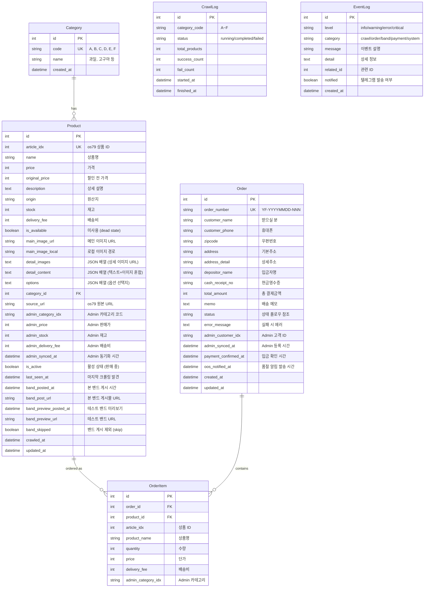
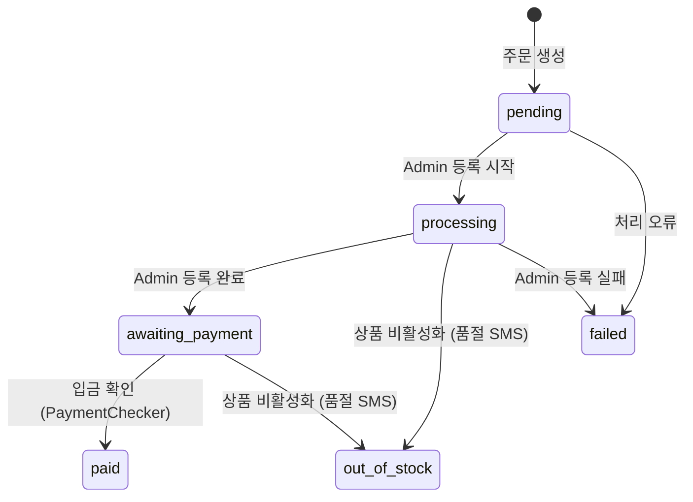

# Fruits_final 프로젝트 문서

## 프로젝트 개요

**목적**: os79.co.kr 사이트에서 과일/농산물 상품 데이터를 크롤링하고, Young Fresh Mall 쇼핑몰을 운영하며, 네이버 밴드 자동 홍보 포스팅, admin.open79.co.kr 주문 자동 등록, 입금 확인 자동화, 텔레그램 봇 관리까지 처리하는 통합 시스템

**핵심 기능**:
1. **크롤러** - os79.co.kr에서 상품 데이터 수집 + Admin 드롭다운 동기화 + IP 차단 방지
2. **쇼핑몰** - Young Fresh Mall 프론트엔드 (주문/결제, Gunicorn 프로덕션)
3. **밴드 포스팅** - 네이버 밴드 자동 게시물 작성 (Persistent Chrome + CDP 쿠키)
4. **주문 자동화** - Admin 사이트에 고객등록 + 주문등록 자동화
5. **입금 확인** - Admin 입금 상태 자동 확인 + SMS 알림
6. **품절 안내** - 비활성화 상품의 미입금 주문에 품절 SMS 발송
7. **SMS 알림** - Aligo API 통한 주문/입금/품절 문자 발송
8. **텔레그램 봇** - 실시간 알림, 밴드 게시 승인/거부, 원격 명령

**기술 스택**: Python 3.9/3.11, Flask, Gunicorn, SQLAlchemy, BeautifulSoup, Selenium, SQLite

**서버 환경**: OpenClaw Mac (Tailscale IP: 100.79.50.94), Gunicorn + Nginx 프로덕션

---

## 시스템 아키텍처 (Mermaid Diagrams)

### 1. 전체 시스템 구조



### 2. 크롤링 + 비활성화 + 품절 알림 플로우



### 3. 밴드 포스팅 플로우 (Persistent Chrome + CDP)



### 4. 주문 + 입금 확인 플로우



### 5. 텔레그램 봇 명령 체계

```mermaid
flowchart TD
    subgraph "텔레그램 봇 (@YoungfreshBot)"
        MSG[메시지 수신<br/>getUpdates Polling]
        AUTH{_is_authorized?<br/>TELEGRAM_CHAT_ID<br/>+ TELEGRAM_GROUP_IDS}

        MSG --> AUTH
        AUTH -->|NO| IGNORE[무시]
        AUTH -->|YES| ROUTE{명령 분기}

        ROUTE --> START[/start<br/>환영 + 명령 목록]
        ROUTE --> STATUS[/status<br/>상품/주문 통계]
        ROUTE --> PENDING[/pending<br/>미게시 상품 목록<br/>카테고리별 넘버링]
        ROUTE --> POST[/post 번호<br/>테스트 밴드 게시<br/>예: /post 1 3 5-8]
        ROUTE --> SKIP[/skip 번호<br/>pending에서 제외<br/>예: /skip 1 3 5-8]
        ROUTE --> UNSKIP[/unskip list|all<br/>제외 목록/복원]
        ROUTE --> HELP[/help<br/>도움말]

        POST --> THREAD[백그라운드 스레드<br/>BandPoster 실행]
        THREAD --> APPROVE_REQ[승인 요청<br/>인라인 버튼]

        APPROVE_REQ --> APPROVE[✅ 승인<br/>→ 본 밴드 게시]
        APPROVE_REQ --> REJECT[❌ 거부<br/>→ 스킵]
    end

    subgraph "시스템 알림 (자동)"
        ALERT[send_alert<br/>에러/이벤트 알림]
        ALERT --> CHAT_ID[TELEGRAM_CHAT_ID로<br/>자동 발송]
    end

    style AUTH fill:#fff3cd
    style POST fill:#e3f2fd
    style APPROVE fill:#d4edda
    style REJECT fill:#f8d7da
    style ALERT fill:#fce4ec
```

### 6. 데이터베이스 스키마



### 7. 주문 상태 플로우



---

## 파일 구조

```
Fruits_final/
├── config.py              # 설정 (URL, 카테고리, 밴드, SMS, 텔레그램, IP 차단 방지)
├── models.py              # SQLAlchemy 모델 (Category, Product, Order, OrderItem, CrawlLog, EventLog)
├── crawler.py             # 크롤러 + Admin 동기화 + 비활성화 + 품절 SMS
├── main.py                # CLI 진입점 (크롤링, 밴드, 봇, 통계)
├── app.py                 # Young Fresh Mall 쇼핑몰 (Gunicorn :5000)
├── band_poster.py         # 네이버 밴드 자동 포스팅 (Persistent Chrome + CDP)
├── order_processor.py     # Admin 주문 자동 등록
├── payment_checker.py     # Admin 입금 확인 자동화
├── sms.py                 # Aligo SMS 발송 (주문/입금/품절)
├── telegram_bot.py        # 텔레그램 봇 (명령, 승인, 알림)
├── viewer.py              # 크롤링 데이터 뷰어
├── admin_visual_test.py   # Admin 시각적 테스트 (포트 5002)
├── PROJECT_DOCUMENTATION.md  # 이 문서
├── .env                   # 환경변수 (API 키, 비밀번호 등)
├── .gitignore
└── data/
    ├── products.db        # SQLite 데이터베이스
    ├── images/            # 다운로드된 상품 이미지
    ├── YF_final_image.jpg # 꼬리 교체용 YoungFreshMall 홍보 이미지
    ├── chrome_profile/    # Persistent Chrome 프로필 (밴드 로그인 세션)
    └── cookies.json       # CDP 쿠키 (Naver SSO 세션)
```

---

## 1. 설정 (config.py)

### 경로
```python
BASE_DIR = Path(__file__).parent
DATA_DIR = BASE_DIR / "data"
IMAGES_DIR = DATA_DIR / "images"
DB_PATH = DATA_DIR / "products.db"
TAIL_IMAGE_PATH = DATA_DIR / "YF_final_image.jpg"  # 마지막 이미지 교체용
```

### 크롤링 설정
```python
BASE_URL = "https://os79.co.kr"
REQUEST_DELAY_MIN = 1.0   # 요청 간 최소 대기 (초)
REQUEST_DELAY_MAX = 3.0   # 요청 간 최대 대기 (초)
REQUEST_TIMEOUT = 30      # 요청 타임아웃 (초)
MAX_RETRIES = 3

# IP 차단 방지
BLOCK_BACKOFF_BASE = 10   # 403/429 기본 백오프 (초)
BLOCK_BACKOFF_MAX = 120   # 최대 백오프 (초)
USER_AGENTS = [...]       # 10개 브라우저 UA 로테이션
```

### 카테고리 코드
```python
CATEGORIES = {
    "A": "과일",
    "B": "고구마, 야채 BEST",
    "C": "수산",
    "D": "축산",
    "E": "쌀, 잡곡",
    "F": "건어물, 기타",
}
```

### 밴드 설정
```python
BAND_PREVIEW_URL = "https://band.us/page/101768540"  # 테스트 밴드
BAND_PRODUCTION_URL = ""                               # 본 밴드 (운영용)
SHOPPING_MALL_URL = "https://youngfresh.net"           # 쇼핑몰 도메인
OUR_KAKAO_URL = "https://open.kakao.com/o/sNgjJoBb"   # 우리 카카오 오픈채팅
SELLER_KAKAO_URL = "https://open.kakao.com/o/gF7nJ96h" # 원판매자 카카오 (교체 대상)
```

### 환경변수 (.env)
```
ALIGO_API_KEY, ALIGO_USER_ID, ALIGO_SENDER    # SMS
ADMIN_ID, ADMIN_PW                              # Admin 로그인
TELEGRAM_BOT_TOKEN, TELEGRAM_CHAT_ID           # 텔레그램 봇
TELEGRAM_GROUP_IDS                              # 그룹 채팅 허용 (쉼표 구분)
FLASK_SECRET_KEY                                # Flask (필수)
FLASK_HOST, FLASK_PORT                          # 기본: 127.0.0.1:5000
BAND_PREVIEW_URL, BAND_PRODUCTION_URL          # 밴드 URL
SHOPPING_MALL_URL                               # 쇼핑몰 공개 URL
```

---

## 2. 크롤러 (crawler.py)

### OS79Crawler 클래스

#### IP 차단 방지
- `_rotate_headers()`: 매 요청마다 10개 UA 중 랜덤 선택 + Referer 설정
- `_random_delay()`: `uniform(REQUEST_DELAY_MIN, REQUEST_DELAY_MAX)` 랜덤 대기
- `_request(url)`: 403/429 응답 시 지수 백오프 (10초~120초, +50% 지터)

#### `crawl_all(download_images=True)`
1. DB 초기화 + `crawl_started_at` 기록
2. 각 카테고리(A~F) → `crawl_category()` (UA 로테이션 + 랜덤 딜레이)
3. `deactivate_missing_products()` — os79 미발견 상품 비활성화
   - **안전장치**: 50% 이상 대상 시 크롤링 오류 판단 → 비활성화 스킵
4. `fetch_admin_mapping()` → `sync_admin_data()` — Admin 드롭다운 동기화
5. `notify_out_of_stock_orders()` — 비활성화 상품의 미입금 주문에 품절 SMS

#### `notify_out_of_stock_orders(deactivated_article_ids)`
- `status IN ('processing', 'awaiting_payment')` + `oos_notified_at IS NULL` 주문 조회
- 해당 주문에 비활성화 상품 포함 시 SMS 발송
- 성공: `oos_notified_at` 기록 + `status='out_of_stock'`
- 실패: 다음 크롤링 때 재시도

#### 상품 데이터 구조
- `detail_content`: `[{"type": "text", "content": "..."}, {"type": "image", "url": "..."}]` — 텍스트+이미지 순서 보존
- `detail_images`: `["url1", "url2", ...]` — 이미지 URL만 (밴드 포스팅용)

---

## 3. 밴드 포스팅 (band_poster.py)

### Persistent Chrome 모드

밴드 로그인 세션을 유지하기 위해 Chrome을 상시 실행:
- `start_persistent_chrome()`: Chrome 바이너리 직접 실행 (`subprocess.Popen`)
  - `--remote-debugging-port=9222`
  - `--user-data-dir=data/chrome_profile`
- `is_chrome_running()`: `http://127.0.0.1:9222/json/version` 체크

### CDP 쿠키 전송 (Chrome DevTools Protocol)
macOS Keychain으로 Chrome 쿠키가 머신별 암호화되어 프로필 복사 불가.
대신 CDP로 쿠키를 평문 추출/주입:
- `_save_cookies()`: `Network.getAllCookies` → `data/cookies.json` (Naver SSO 포함)
- `_load_cookies()`: `Network.setCookies` ← `data/cookies.json`
- **필수 로그인 설정**: "Stay Signed In" 체크 + "IP Security OFF"

### BandPoster 클래스
- `_init_driver()`: Persistent Chrome에 `debuggerAddress`로 연결 시도 → 실패 시 새 Chrome 실행
- `close()`: `_attached=True`면 Chrome 유지 (드라이버만 해제), `False`면 `driver.quit()`
- `check_login()`: 밴드 페이지 접근 → 글쓰기 버튼 존재 확인
- `_dismiss_alert()`: band.us JS alert 핸들링 (UnexpectedAlertPresentException 방지)

### 이미지 처리
- main 이미지 제외 (detail 첫 장과 동일, 중복 방지)
- detail 이미지: 로컬 캐시 확인 → 없으면 URL에서 다운로드
- **꼬리 이미지 교체**: Pillow로 마지막 이미지 높이 체크 → `>4000px`이면 `YF_final_image.jpg`로 교체

### 게시물 작성 (`_write_post()`)
1. 밴드 페이지 이동 + 글쓰기 버튼 클릭
2. CKEditor `setData()` API로 텍스트 입력 (각 줄 `<p>` 태그)
3. `input[type=file]`에 이미지 경로 전달 → "첨부하기" 클릭
4. 게시 버튼 클릭 → `current_url` 캡처

### Incremental 포스팅 함수
- `get_unposted_products()`: `is_active=True AND band_posted_at=NULL AND band_skipped!=True`
- `band_post_preview(article_idx)`: 테스트 밴드 → `band_preview_posted_at/url` 저장
- `band_post_confirm(article_idx)`: 본 밴드 → `band_posted_at/url` 저장

---

## 4. 쇼핑몰 (app.py)

### Young Fresh Mall — Gunicorn :5000

**주요 라우트**:

| 경로 | 설명 |
|------|------|
| `/` | 메인 페이지 (전체 활성 상품) |
| `/category/<code>` | 카테고리별 상품 |
| `/search?q=` | 상품 검색 |
| `/product/<article_idx>` | 상품 상세 |
| `/order/<article_idx>` | 주문 페이지 |
| `/order/submit` | 주문 제출 (POST) |
| `/order/complete/<order_number>` | 주문 완료 |
| `/data-images/<filename>` | data/ 폴더 이미지 서빙 |
| `/api/orders/<order_number>/confirm-payment` | 수동 입금 확인 |
| `/api/payments/check` | 입금 확인 체크 |

### is_active 필터 (핵심 안전장치)
모든 상품 조회에 `is_active` 필터 적용. 비활성 상품은 쇼핑몰 어디에서도 접근 불가.

### 꼬리 이미지 처리 (클라이언트)
- **과일(A) 카테고리 전용**: 상세정보 하단에 `YF_final_image.jpg` 항상 표시
- **JS 높이 체크**: 마지막 상세 이미지 `naturalHeight > 4000px` → `display:none` (원판매자 홍보 이미지 숨김)

### 앱 시작 시
- `payment_checker.start_periodic(30)` — 입금 확인 스케줄러 가동
- `start_bot_thread()` — 텔레그램 봇 polling 시작

---

## 5. 입금 확인 (payment_checker.py)

### PaymentChecker 클래스

**하이브리드 스케줄러**: 주문 후 10분 뒤 확인 + 유휴 시 30분 주기

1. Admin 주문 목록 조회 (`p_order_list.asp`)
2. "입금완료" 상태 매칭 (고객명 + 상품명 2단계 매칭)
3. 매칭 성공: `status→paid`, `payment_confirmed_at` 기록, 입금 확인 SMS 발송
4. 수동 확인도 Admin 입금 상태 검증 필수 (이중 안전장치)

---

## 6. 주문 자동화 (order_processor.py)

### AdminOrderProcessor 클래스

1. **로그인**: `POST /m/include/asp/login_ok.asp` (EUC-KR)
2. **고객 등록**: `POST /m/customer/p_custom_regist_ok.asp` → `customer_idx`
3. **상품 데이터 조회**: `js_article.asp` 파싱
4. **주문 등록**: `POST /m/customer/p_order_regist_ok.asp` (수량 N → N회 반복)

**주문번호**: `YF-YYYYMMDD-NNN` (예: YF-20260303-001)

---

## 7. SMS 알림 (sms.py)

### Aligo SMS
- **주문 접수 SMS**: 주문 생성 시 고객에게
- **입금 확인 SMS**: 입금 확인 시 고객에게
- **품절 안내 SMS**: 상품 비활성화 시 미입금 고객에게
- SMS/LMS 자동 결정 (90바이트 기준)
- API 키 미설정 시 발송 건너뜀

---

## 8. 텔레그램 봇 (telegram_bot.py)

### TelegramBotServer — Polling 방식

**봇 명령**:

| 명령 | 설명 |
|------|------|
| `/start` | 환영 + 명령 목록 |
| `/status` | 서버 상태 (상품 수, 주문 수) |
| `/pending` | 밴드 미게시 상품 (카테고리별 넘버링) |
| `/post 번호` | 테스트 밴드 게시 (예: `/post 1 3 5-8`) |
| `/skip 번호` | pending에서 제외 (예: `/skip 1 3 5-8`) |
| `/unskip list` | 제외된 상품 목록 보기 |
| `/unskip all` | 전체 복원 |
| `/help` | 도움말 |

**인라인 버튼**: 승인(✅) / 거부(❌) — 밴드 게시 승인 요청에 대한 응답

**접근 제한**: `TELEGRAM_CHAT_ID` + `TELEGRAM_GROUP_IDS`만 허용, 그 외 무시

**시스템 알림**: `send_alert(level, category, message)` — 에러/이벤트 자동 발송

**그룹 채팅 지원**: 봇이 메시지를 받은 `chat_id`로 응답 (1:1, 그룹 모두 지원)

---

## 9. CLI 명령어 (main.py)

### 크롤링
```bash
python main.py all --no-images       # 전체 크롤링 (이미지 다운로드 없이)
python main.py category A            # 특정 카테고리만
python main.py single 42563          # 단일 상품 테스트
python main.py stats                 # DB 통계
```

### 밴드 포스팅
```bash
python main.py band-chrome           # Persistent Chrome 시작 (:9222)
python main.py band-login            # 밴드 로그인 (최초 1회)
python main.py band-post 42563       # 단일 상품 포스팅
python main.py band-post-category A  # 카테고리 전체 포스팅
```

### Incremental 밴드 포스팅
```bash
python main.py band-new              # 미게시 상품 리스트
python main.py band-new --category A # 카테고리 필터
python main.py band-preview 42563    # 테스트 밴드 미리보기
python main.py band-preview-all      # 전체 미리보기
python main.py band-confirm 42563    # 승인 → 본 밴드 게시
```

### 텔레그램 봇
```bash
python main.py bot                   # 봇 서버 시작 (Polling)
python main.py bot-test              # 테스트 알림 발송
```

### 참고
```bash
# venv activate 대신 직접 경로 사용 (permission 문제)
~/Fruits_final/venv/bin/python main.py all --no-images
```

---

## 10. 서버 운영

### OpenClaw Mac 서버
- **Tailscale IP**: 100.79.50.94
- **SSH**: `ssh ivan@100.79.50.94` (비밀번호: 0000)
- **프로젝트 경로**: `~/Fruits_final/`
- **Python**: `/Library/Developer/CommandLineTools/.../Python.app` (3.9)

### 프로세스 관리
```bash
# Gunicorn (쇼핑몰)
pgrep -f 'gunicorn.*app:app'              # PID 확인
kill -HUP $(pgrep -f 'gunicorn.*app:app' | head -1)  # 코드 리로드

# 텔레그램 봇
pgrep -f 'main.py bot'                    # PID 확인
kill $(pgrep -f 'main.py bot')            # 종료
nohup venv/bin/python -u main.py bot > /tmp/telegram_bot.log 2>&1 &  # 시작

# Persistent Chrome (밴드)
curl -s http://127.0.0.1:9222/json/version  # 상태 확인
```

### 배포 절차
1. 로컬에서 코드 수정 + `git push origin main`
2. 서버: `git pull origin main`
3. Gunicorn: `kill -HUP` (코드 리로드)
4. 봇: `kill` + 재시작 (모듈 캐시 때문에 프로세스 재시작 필수)

### 주의사항
- 봇 프로세스는 import 캐시 → 코드 변경 후 **반드시 재시작**
- 봇 프로세스 중복 실행 시 메시지 2배 발생 (반드시 1개만 유지)
- Persistent Chrome은 `kill`하면 밴드 세션 유지됨 (쿠키 파일 별도)

---

## 11. 트러블슈팅

### EUC-KR 인코딩
- **원인**: Admin 사이트가 EUC-KR 사용
- **해결**: `post_form()`에서 EUC-KR 인코딩, `[]`는 raw body로 처리

### Chrome 쿠키 머신 바인딩
- **원인**: macOS Keychain으로 Chrome 쿠키 암호화 → 프로필 복사 불가
- **해결**: CDP `Network.getAllCookies`/`setCookies`로 평문 전송

### Naver 로그인 세션 만료
- **원인**: IP 변경 시 세션 무효화, 세션 쿠키 브라우저 종료 시 삭제
- **해결**: "Stay Signed In" 체크 (persistent 쿠키) + "IP Security OFF"

### band.us JS Alert 크래시
- **원인**: "잘못된 요청입니다" alert → Selenium `UnexpectedAlertPresentException`
- **해결**: `_dismiss_alert()` 헬퍼 + try-except 핸들링

### 텔레그램 봇 중복 메시지
- **원인**: 봇 프로세스 2개 동시 실행 → 양쪽 모두 같은 명령 처리
- **해결**: 반드시 `pgrep`으로 확인 후 1개만 유지

### DetachedInstanceError
- **원인**: SQLAlchemy 세션 닫은 후 lazy-loaded 관계 접근
- **해결**: `joinedload(Product.category)` + 세션 닫기 전 미리 로드

### venv activate Permission Denied
- **해결**: `venv/bin/python` 직접 경로 사용

---

## 12. 향후 계획

| 우선순위 | 항목 | 상태 |
|---------|------|------|
| 1 | OpenClaw 맥 이전 + 도메인 + 웹 배포 | ✅ 완료 |
| 2 | 텔레그램 봇 + 원격 개발 환경 | ✅ 완료 |
| 3 | 카카오톡 CS 챗봇 | 미착수 |
| 4 | 네이버 밴드 자동화 | preview ✅ / production 홀딩 |
| 5 | 로그인 시스템 | 미착수 |
| 6 | 장바구니 기능 | 미착수 |
| 7 | 선물하기 기능 | 미착수 |
| 8 | 직접 판매 상품 | 미착수 |

---

## 변경 이력

| 날짜 | 내용 |
|------|------|
| 2025-01-20 | 초기 크롤러 및 프론트엔드 구현 |
| 2025-01-21 | Admin 연동 테스트 구현 |
| 2025-01-26 | EUC-KR 인코딩 수정, 전체 크롤링 (211개 상품) |
| 2026-03-02 | Admin 동기화 + 비활성화 로직 구현 |
| 2026-03-02 | Young Fresh Mall 쇼핑몰 + 주문 자동화 구현 |
| 2026-03-02 | Aligo SMS 모듈 구현 |
| 2026-03-02 | 네이버 밴드 자동 포스팅 (Selenium) 구현 |
| 2026-03-03 | Incremental 밴드 포스팅 워크플로우 (band-new/preview/confirm) |
| 2026-03-04 | .env 분리, IP 차단 방지 (UA 로테이션 + 백오프) |
| 2026-03-04 | 품절 안내 SMS 프로세스 (oos_notified_at) |
| 2026-03-04 | 입금 확인 자동화 (payment_checker.py) |
| 2026-03-06 | 텔레그램 봇 구현 (/status, /pending, /post, 승인/거부) |
| 2026-03-06 | OpenClaw Mac 서버 배포 (Gunicorn + Tailscale) |
| 2026-03-08 | Persistent Chrome + CDP 쿠키 전송 (밴드 서버 로그인) |
| 2026-03-08 | 꼬리 이미지 교체 (4000px 초과 → YF 홍보 이미지) |
| 2026-03-08 | 밴드 게시 제외(skip) 기능 (/skip, /unskip) |
| 2026-03-08 | 텔레그램 그룹 채팅 지원 + 접근 제한 |
