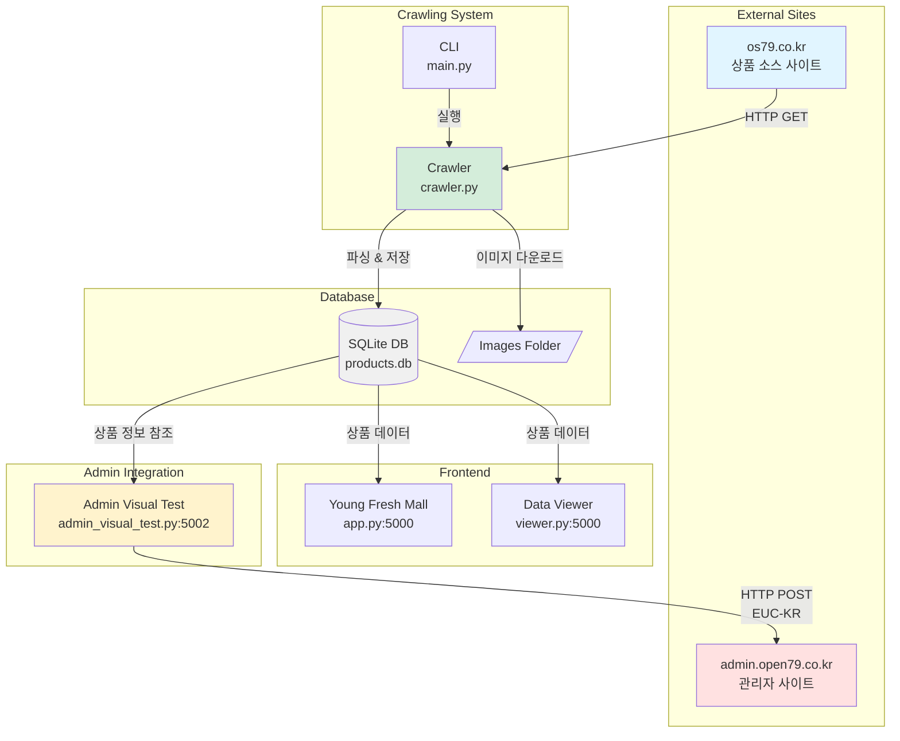
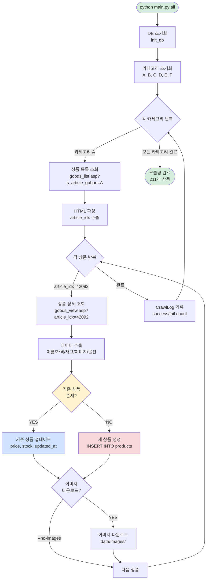
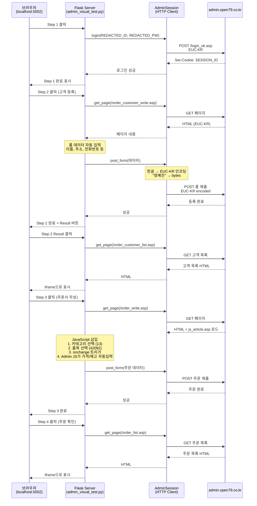
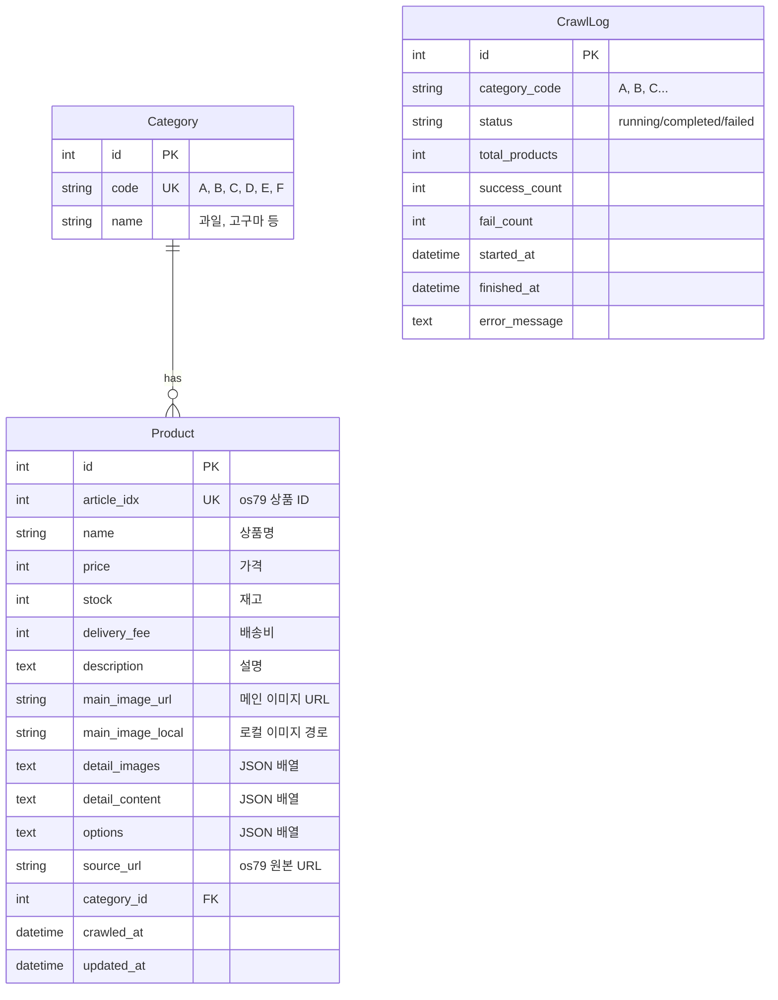
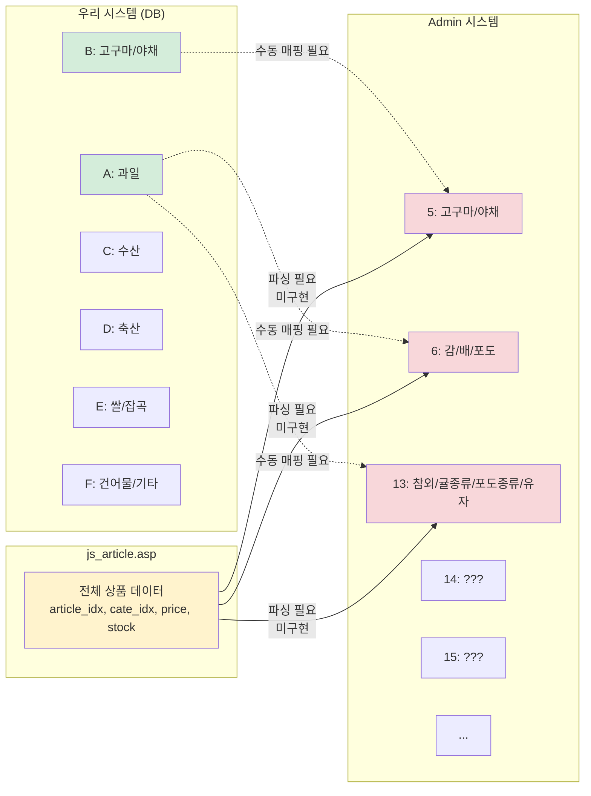
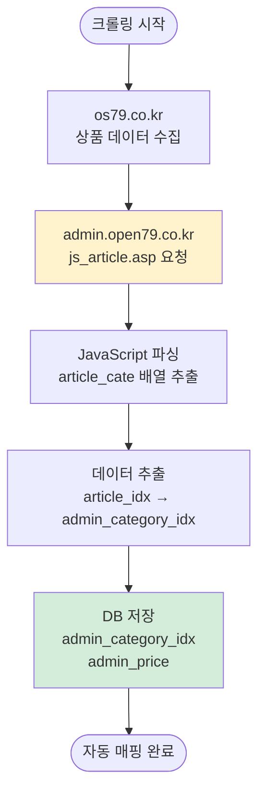
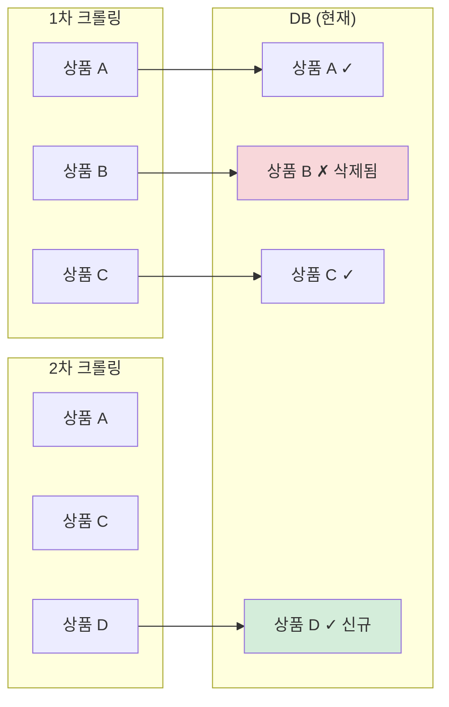
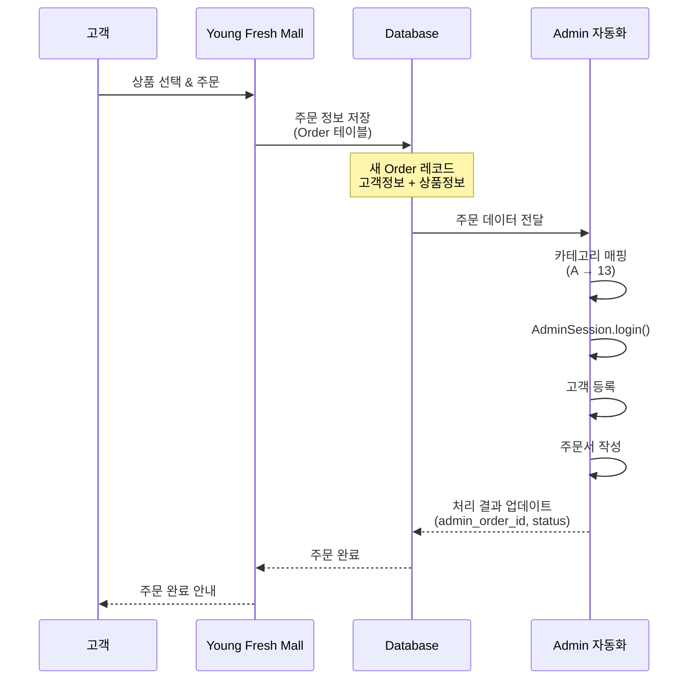

# Fruits_final 프로젝트 문서

## 프로젝트 개요

**목적**: os79.co.kr 사이트에서 과일/농산물 상품 데이터를 크롤링하고, admin.open79.co.kr 관리자 사이트와 연동하여 고객/주문을 자동 등록하는 시스템

**구성요소**:
1. **크롤러** - os79.co.kr에서 상품 데이터 수집
2. **프론트엔드** - Young Fresh Mall 쇼핑몰 UI
3. **Admin 연동** - admin.open79.co.kr 자동화 테스트

---

## 시스템 아키텍처 (Mermaid Diagrams)

### 1. 전체 시스템 구조



### 2. 크롤링 플로우 (상세)



### 3. Admin 테스트 플로우 (4단계)



### 4. 데이터베이스 스키마



### 5. 카테고리 매핑 문제점 (현재 수동 처리)



### 6. 데이터 샘플 예시

**크롤링 데이터 (우리 DB)**
```json
{
  "article_idx": 42092,
  "name": "제주/보배진/레드향(13과)-3kg내외",
  "price": 42500,
  "stock": 36,
  "delivery_fee": 3000,
  "category_id": 1,
  "category_code": "A",
  "options": [
    {
      "value": "42092",
      "text": "제주/보배진/레드향(13과)-3kg내외"
    },
    {
      "value": "42093",
      "text": "2박스*제주/보배진/레드향(26과)-6kg내외"
    }
  ]
}
```

**Admin 테스트 데이터 (수동 매핑)**
```json
{
  "category_idx": "13",
  "article_idx": "42092",
  "product_name": "2박스*제주/보배진/레드향(26과)-6kg내외",
  "price": 47000,
  "delivery_fee": 3000,
  "total_payment": 56700,
  "recipient_name": "정예진",
  "address": "서울특별시 동대문구 서울시립대로 19 청계와이즈노벨리아"
}
```

**js_article.asp 응답 (Admin)**
```javascript
var article_price = new Array();
article_price[42092] = "42500";
var article_stock = new Array();
article_stock[42092] = "36";
var article_cate = new Array();
article_cate[42092] = "13";  // ← 이 매핑이 필요!
```

---

## 파일 구조

```
Fruits_final/
├── config.py              # 설정 파일 (URL, 카테고리 등)
├── models.py              # SQLAlchemy DB 모델
├── crawler.py             # 크롤러 핵심 로직
├── main.py                # CLI 진입점
├── app.py                 # Young Fresh Mall 프론트엔드 (포트 5000)
├── viewer.py              # 크롤링 데이터 뷰어 (포트 5000)
├── admin_visual_test.py   # Admin 시각적 테스트 (포트 5002)
├── admin_test.py          # Admin HTTP 테스트 (CLI)
├── admin_test_web.py      # Admin 웹 테스트 (초기 버전)
└── data/
    ├── products.db        # SQLite 데이터베이스
    └── images/            # 다운로드된 이미지
```

---

## 1. 설정 (config.py)

### 크롤링 대상
```python
BASE_URL = "https://os79.co.kr"
GOODS_LIST_URL = f"{BASE_URL}/board_order/goods_list.asp"
GOODS_VIEW_URL = f"{BASE_URL}/board_order/goods_view.asp"
```

### 카테고리 코드 (우리 시스템)
```python
CATEGORIES = {
    "A": "과일",
    "B": "고구마, 야채 BEST",
    "C": "수산",
    "D": "축산",
    "E": "쌀, 잡곡",
    "F": "건어물, 기타",
}
```

> **중요**: Admin 사이트는 다른 카테고리 코드를 사용함
> - Admin "5" = 고구마/야채
> - Admin "6" = 감/배/포도
> - Admin "13" = 참외/귤종류/포도종류/유자
> - 등등 (js_article.asp에서 확인 가능)

### 기타 설정
- `REQUEST_DELAY`: 1.0초 (요청 간 대기)
- `REQUEST_TIMEOUT`: 30초
- `MAX_RETRIES`: 3회
- `DB_PATH`: data/products.db

---

## 2. 데이터베이스 모델 (models.py)

### Category 테이블
```python
class Category(Base):
    __tablename__ = "categories"
    id = Column(Integer, primary_key=True)
    code = Column(String(10), unique=True)  # A, B, C, D, E, F
    name = Column(String(100))              # 과일, 고구마 등
```

### Product 테이블
```python
class Product(Base):
    __tablename__ = "products"

    # 기본 키
    id = Column(Integer, primary_key=True)
    article_idx = Column(Integer, unique=True)  # os79 사이트 상품 ID

    # 상품 정보
    name = Column(String(500))
    price = Column(Integer, default=0)
    original_price = Column(Integer, default=0)
    description = Column(Text)
    stock = Column(Integer, default=0)
    delivery_fee = Column(Integer, default=0)

    # 이미지
    main_image_url = Column(String(1000))   # 원본 URL
    main_image_local = Column(String(500))  # 로컬 경로
    detail_images = Column(Text)            # JSON 배열
    detail_content = Column(Text)           # JSON 배열 (텍스트+이미지 순서 유지)

    # 옵션
    options = Column(Text)  # JSON 배열: [{"value": "42092", "text": "2박스*..."}]

    # 메타
    source_url = Column(String(1000))
    category_id = Column(Integer, ForeignKey("categories.id"))
    crawled_at = Column(DateTime)
    updated_at = Column(DateTime)
```

### CrawlLog 테이블
크롤링 실행 기록 (성공/실패 카운트, 상태 등)

---

## 3. 크롤러 (crawler.py)

### 주요 메서드

#### `get_product_list(category_code)`
카테고리별 상품 목록 조회
- URL: `goods_list.asp?s_article_gubun=A`
- 반환: `[{article_idx, name_preview, url}, ...]`

#### `get_product_detail(article_idx)`
개별 상품 상세 정보 크롤링
- URL: `goods_view.asp?article_idx=42092`
- 파싱 항목:
  - `#txt_article_name` → 상품명
  - `#txt_article_price` → 가격
  - `.viewImg` style background → 메인 이미지
  - `#article_stock` → 재고
  - `#txt_article_delivery` → 배송비
  - `.vw_content` → 상세 콘텐츠
  - `#goods_idx` select → 옵션

#### `save_product(product_data, category)`
**DB 저장 로직 (중요!)**
```python
existing = self.db_session.query(Product).filter_by(
    article_idx=product_data['article_idx']
).first()

if existing:
    # 기존 상품 업데이트
    existing.name = product_data.get('name', existing.name)
    existing.price = ...
    existing.updated_at = datetime.now()
else:
    # 새 상품 생성
    product = Product(...)
    self.db_session.add(product)
```

> **DB 동작**: 누적 + 업데이트 구조
> - 기존 데이터를 지우지 않음
> - 같은 article_idx면 최신 정보로 갱신
> - 새 상품은 추가
> - 삭제된 상품은 DB에 남아있음 (자동 삭제 안 됨)

### 크롤링 실행

```bash
# 전체 크롤링
python main.py all

# 이미지 없이 전체 크롤링
python main.py all --no-images

# 특정 카테고리만
python main.py category A

# 단일 상품 테스트
python main.py single 42092

# DB 통계
python main.py stats
```

---

## 4. 프론트엔드

### Young Fresh Mall (app.py) - 포트 5000

실제 쇼핑몰 UI
- 메인 페이지: 전체/카테고리별 상품 그리드
- 상세 페이지: 상품 정보, 옵션 선택, 구매 버튼

```bash
python app.py
# http://127.0.0.1:5000
```

### 데이터 뷰어 (viewer.py) - 포트 5000

크롤링 데이터 품질 확인용
- 데이터 품질 통계 (이미지율, 가격율 등)
- 각 상품별 수집 상태 표시

```bash
python viewer.py
# http://127.0.0.1:5000
```

---

## 5. Admin 사이트 연동 (admin_visual_test.py)

### 개요
- 대상: http://admin.open79.co.kr
- 방식: HTTP Request (Selenium 아님)
- 포트: 5002

### 테스트 플로우

```
Step 1: 로그인
    ↓
Step 2: 고객 등록 (폼 자동 입력)
    ↓
Step 2 Result: 고객 목록에서 확인
    ↓
Step 3: 주문서 작성 (폼 자동 입력)
    ↓
Step 4: 주문 목록에서 확인
```

### AdminSession 클래스

```python
class AdminSession:
    BASE_URL = "http://admin.open79.co.kr"

    def login(self, user_id, password):
        # POST /m/include/asp/login_ok.asp

    def get_page(self, path):
        # GET 요청, EUC-KR 디코딩

    def post_form(self, path, data):
        # POST 요청, EUC-KR 인코딩 (중요!)
        encoded_data = {}
        for key, value in data.items():
            if isinstance(value, str):
                encoded_data[key] = value.encode('euc-kr', errors='ignore')
            else:
                encoded_data[key] = value
```

### 테스트 데이터 (SAMPLE_ORDER_DATA)

```python
SAMPLE_ORDER_DATA = {
    "depositor_name": "정예진",           # 입금자
    "recipient_name": "정예진",           # 받는 사람
    "phone": "REDACTED_PHONE",
    "zipcode": "02504",
    "address": "서울특별시 동대문구 서울시립대로 19 청계와이즈노벨리아",
    "address_detail": "101동 1002호",
    "cash_receipt_no": "REDACTED_PHONE",
    "memo": "부재시 경비실에 맡겨주세요",

    # Admin 상품 정보 (중요!)
    "product_name": "2박스*제주/보배진/레드향(26과)-6kg내외",
    "category_idx": "13",     # Admin 카테고리 코드 (우리 코드와 다름!)
    "article_idx": "42092",   # Admin 상품 ID
    "price": 47000,
    "delivery_fee": 3000,
    "total_payment": 56700,   # 고객 입금액
    "quantity": 1
}
```

### 주요 포인트

#### 1. EUC-KR 인코딩
Admin 사이트는 EUC-KR 인코딩 사용. 한글 폼 데이터 전송 시 반드시 인코딩 필요.

#### 2. 카테고리/상품 매핑
- 우리 DB 카테고리: A, B, C, D, E, F
- Admin 카테고리: 5, 6, 13, ... (숫자)
- **현재 수동 매핑 중** - 향후 자동화 필요

#### 3. 품목 자동 선택
Admin의 js_article.asp가 상품 드롭다운에 데이터 제공.
JavaScript로 자동 선택 후 onchange 이벤트 트리거:
```javascript
var articleSelect = document.querySelector('select[name="g_article_idx[]"]');
articleSelect.selectedIndex = i;
var event = new Event('change', { bubbles: true });
articleSelect.dispatchEvent(event);
```

#### 4. 가격 자동 입력
Admin JS가 상품 선택 시 가격/재고 자동 입력.
우리는 이 값을 그대로 사용 (오버라이드 안 함).
단, `total_payment` 필드로 고객 입금액은 별도 지정 가능.

### 실행

```bash
python admin_visual_test.py
# http://127.0.0.1:5002
```

---

## 6. 향후 개선 사항

### 1. Admin 데이터 동기화 (미구현)

**목표**: 크롤링 시 js_article.asp 파싱하여 Admin 정보 자동 수집



**필요한 코드 변경**:

Product 모델 확장:
```python
class Product(Base):
    # 기존 필드...

    # 추가 필드
    admin_category_idx = Column(String(10))  # Admin 카테고리 코드
    admin_article_idx = Column(Integer)       # Admin 상품 ID (동일할 가능성 높음)
    admin_price = Column(Integer)             # Admin 가격
    admin_stock = Column(Integer)             # Admin 재고
    admin_synced = Column(Boolean, default=False)  # 동기화 여부
    admin_synced_at = Column(DateTime)        # 동기화 시간
```

crawler.py 추가 메서드:
```python
def fetch_admin_mapping(self):
    """Admin js_article.asp에서 매핑 데이터 가져오기"""
    url = "http://admin.open79.co.kr/m/include/js_article.asp"
    response = requests.get(url)

    # JavaScript 파싱
    # var article_cate = new Array();
    # article_cate[42092] = "13";
    cate_pattern = r'article_cate\[(\d+)\]\s*=\s*"(\d+)"'
    price_pattern = r'article_price\[(\d+)\]\s*=\s*"(\d+)"'

    mappings = {}
    for match in re.finditer(cate_pattern, response.text):
        article_idx = int(match.group(1))
        category_idx = match.group(2)
        if article_idx not in mappings:
            mappings[article_idx] = {}
        mappings[article_idx]['admin_category_idx'] = category_idx

    return mappings
```

### 2. 삭제된 상품 처리

**현재 문제**: DB는 삭제된 상품도 영구 보존



**해결 방안**:

```python
class Product(Base):
    # 추가 필드
    is_active = Column(Boolean, default=True)  # 활성 상태
    last_seen_at = Column(DateTime)  # 마지막 크롤링 확인 시간

# 크롤링 로직 수정
def crawl_category(self, category_code):
    # 1. 크롤링 시작 전: 모든 상품 is_active = False
    existing_products = self.db_session.query(Product).filter_by(category_id=category.id).all()
    for p in existing_products:
        p.is_active = False

    # 2. 크롤링 중: 발견된 상품만 is_active = True
    product = self.save_product(product_data, category)
    product.is_active = True
    product.last_seen_at = datetime.now()

    # 3. 크롤링 완료 후: is_active = False인 상품은 삭제됨
```

### 3. 실제 주문 연동

**목표**: 테스트 데이터 → 실제 Young Fresh Mall 주문 데이터 연동



**필요한 추가 모델**:

```python
class Order(Base):
    __tablename__ = "orders"

    id = Column(Integer, primary_key=True)
    order_number = Column(String(50), unique=True)

    # 고객 정보
    customer_name = Column(String(100))
    customer_phone = Column(String(20))
    customer_address = Column(String(500))

    # 상품 정보
    product_id = Column(Integer, ForeignKey("products.id"))
    product_option = Column(String(500))
    quantity = Column(Integer)
    price = Column(Integer)
    total_amount = Column(Integer)

    # Admin 연동
    admin_order_id = Column(Integer)  # Admin에 등록된 주문 ID
    admin_status = Column(String(20))  # pending/registered/failed
    admin_registered_at = Column(DateTime)

    created_at = Column(DateTime, default=datetime.now)
```

---

## 7. 트러블슈팅

### 한글 깨짐 문제
- **원인**: Admin 사이트가 EUC-KR 사용
- **해결**: `post_form()`에서 데이터를 EUC-KR로 인코딩

### 품목 선택 안 됨
- **원인**: 카테고리 선택 후 onchange로 품목 로드됨
- **해결**: JavaScript로 카테고리 선택 → 품목 선택 → onchange 트리거

### 가격 불일치
- **원인**: Admin JS가 자동 입력한 값과 우리 데이터 다름
- **해결**: Admin 값 그대로 사용, `total_payment`로 입금액만 별도 지정

---

## 8. 로그인 정보

### Admin 사이트
- URL: http://admin.open79.co.kr
- ID: REDACTED_ID
- PW: REDACTED_PW

---

## 9. 자주 사용하는 명령어

```bash
# 가상환경 활성화
source venv/bin/activate

# 전체 크롤링 (이미지 제외)
python main.py all --no-images

# DB 통계 확인
python main.py stats

# Young Fresh Mall 실행
python app.py

# Admin 테스트 실행
python admin_visual_test.py

# DB 직접 조회 (SQLite)
sqlite3 data/products.db
.tables
SELECT COUNT(*) FROM products;
SELECT * FROM products LIMIT 5;
```

---

## 10. 실제 동작 예시 (시퀀스)

### 예시 1: 크롤링 실행

```bash
$ python main.py all --no-images

==================================================
Starting category: 과일 (A)
==================================================

[Category A] Fetching: https://os79.co.kr/board_order/goods_list.asp?s_article_gubun=A
[Category A] Found 89 products

Crawling 과일: 100%|███████████████| 89/89 [02:15<00:00,  1.52s/it]

Category A completed: 89 success, 0 fail

==================================================
Starting category: 고구마, 야채 BEST (B)
==================================================
...

총 결과: 211개 상품 수집 완료
```

### 예시 2: Admin 테스트 플로우

```
브라우저: http://localhost:5002

1. [Step 1: Login] 클릭
   → admin.open79.co.kr 로그인
   → "✓ Step 1 완료" 표시

2. [Step 2: Register Customer] 클릭
   → 고객 등록 폼 자동 입력
     - 이름: 정예진
     - 주소: 서울특별시 동대문구 서울시립대로 19...
     - 전화번호: REDACTED_PHONE
   → "✓ Step 2 완료" 표시
   → [View Result] 버튼 활성화

3. [Step 2: View Result] 클릭
   → iframe에 고객 목록 표시
   → 방금 등록한 "정예진" 확인 가능

4. [Step 3: Create Order] 클릭
   → 주문서 작성 폼 자동 입력
     - 카테고리: 13 (참외/귤종류/포도종류/유자)
     - 품목: 42092 (레드향)
     - 가격: 42,500원 (Admin JS 자동입력)
     - 재고: 36 (Admin JS 자동입력)
     - 고객 입금액: 56,700원
   → "✓ Step 3 완료" 표시

5. [Step 4: View Orders] 클릭
   → iframe에 주문 목록 표시
   → 방금 생성한 주문 확인 가능
```

### 예시 3: DB에서 상품 조회

```bash
$ python main.py stats

=== 크롤링 통계 ===
총 상품 수: 211
카테고리별:
  A (과일): 89
  B (고구마, 야채 BEST): 45
  C (수산): 23
  D (축산): 18
  E (쌀, 잡곡): 21
  F (건어물, 기타): 15

데이터 품질:
  메인 이미지: 198/211 (93.8%)
  가격 정보: 211/211 (100.0%)
  상품 설명: 189/211 (89.6%)
  상세 콘텐츠: 176/211 (83.4%)
```

```bash
$ sqlite3 data/products.db

sqlite> SELECT article_idx, name, price, stock FROM products WHERE article_idx = 42092;

42092|제주/보배진/레드향(13과)-3kg내외|42500|36
```

### 예시 4: 옵션 데이터 구조

```python
# DB에서 가져온 Product.options (JSON 문자열)
'[
  {"value": "42092", "text": "제주/보배진/레드향(13과)-3kg내외"},
  {"value": "42093", "text": "2박스*제주/보배진/레드향(26과)-6kg내외"}
]'

# Python에서 파싱
import json
options = json.loads(product.options)
print(options[0]['text'])
# 출력: 제주/보배진/레드향(13과)-3kg내외

# app.py에서 사용

  <option value="{{ opt.value }}">{{ opt.text }}</option>

```

### 예시 5: detail_content 구조 (텍스트+이미지 순서 유지)

```python
# DB에서 가져온 Product.detail_content (JSON 문자열)
'[
  {"type": "text", "content": "제주 청정 지역에서 재배된 레드향입니다."},
  {"type": "image", "url": "https://os79.co.kr/admin/file_data/detail_001.jpg"},
  {"type": "text", "content": "달콤하고 상큼한 맛이 일품입니다."},
  {"type": "image", "url": "https://os79.co.kr/admin/file_data/detail_002.jpg"}
]'

# viewer.py에서 렌더링

  
    <div class="text-block">{{ item.content }}</div>
  
    <div class="image-block">
      
    </div>
  

```

---

## 변경 이력

| 날짜 | 내용 |
|------|------|
| 2025-01-20 | 초기 크롤러 및 프론트엔드 구현 |
| 2025-01-21 | Admin 연동 테스트 구현 |
| 2025-01-26 | EUC-KR 인코딩 수정, 테스트 데이터 업데이트 |
| 2025-01-26 | 전체 크롤링 실행 (211개 상품) |
