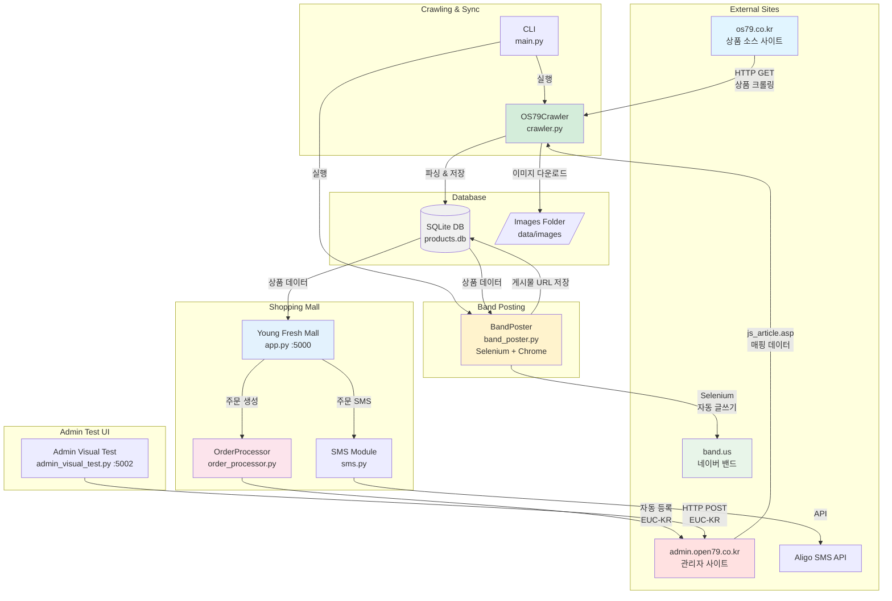
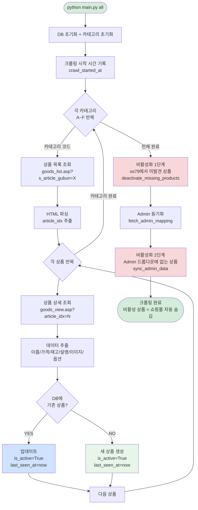
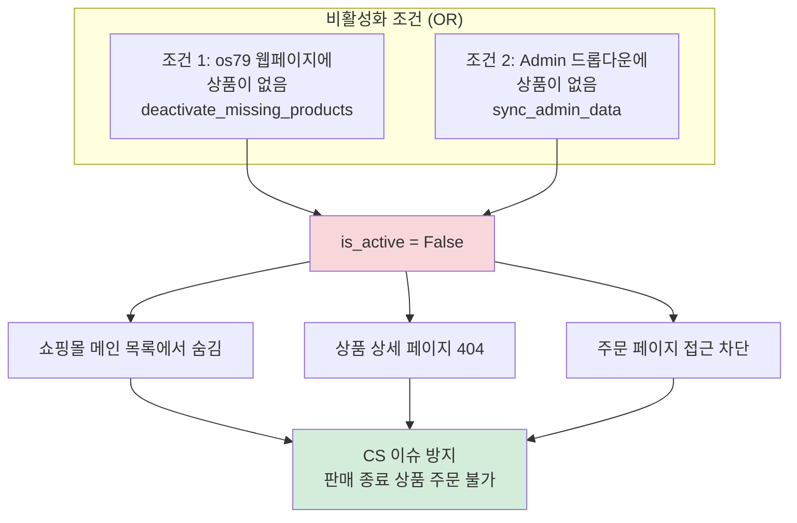
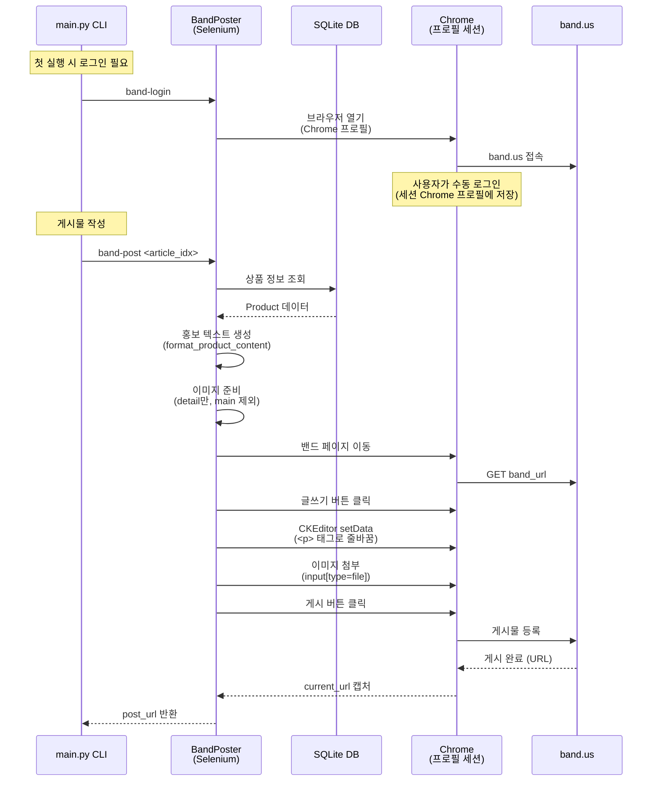
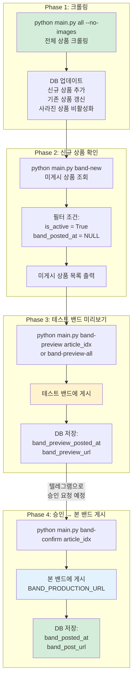
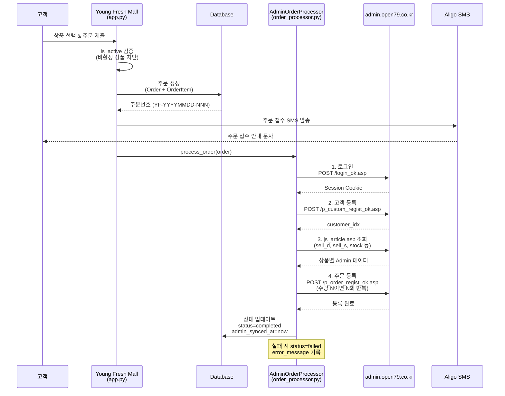
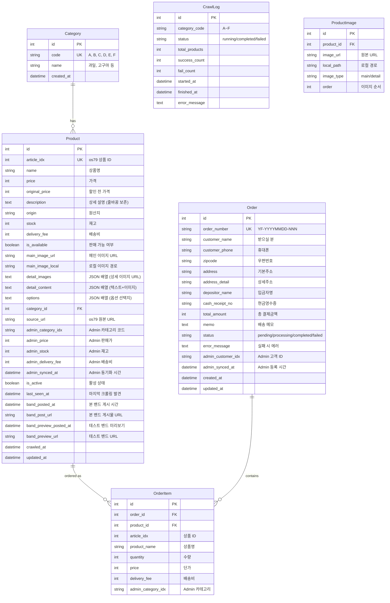
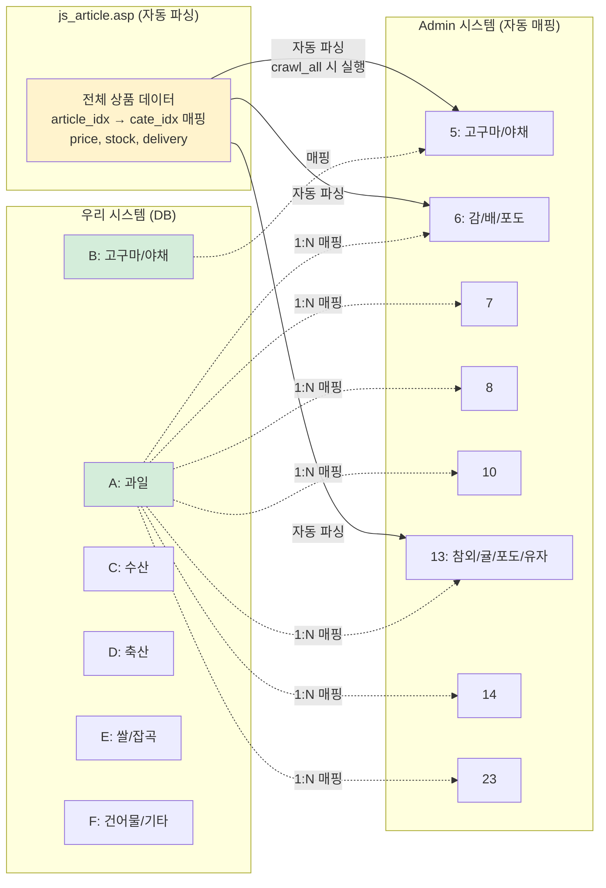
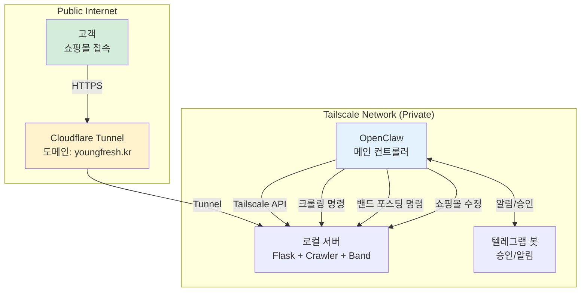

# Fruits_final 프로젝트 문서

## 프로젝트 개요

**목적**: os79.co.kr 사이트에서 과일/농산물 상품 데이터를 크롤링하고, Young Fresh Mall 쇼핑몰을 운영하며, 네이버 밴드 자동 홍보 포스팅 및 admin.open79.co.kr 주문 자동 등록까지 처리하는 통합 시스템

**핵심 기능**:
1. **크롤러** - os79.co.kr에서 상품 데이터 수집 + Admin 드롭다운 동기화
2. **쇼핑몰** - Young Fresh Mall 프론트엔드 (주문/결제)
3. **밴드 포스팅** - 네이버 밴드 자동 게시물 작성 (Selenium)
4. **주문 자동화** - Admin 사이트에 고객등록 + 주문등록 자동화
5. **SMS 알림** - Aligo API 통한 주문/입금 확인 문자 발송

**기술 스택**: Python 3.11, Flask, SQLAlchemy, BeautifulSoup, Selenium, SQLite

---

## 시스템 아키텍처 (Mermaid Diagrams)

### 1. 전체 시스템 구조



### 2. 크롤링 + 상품 비활성화 플로우



### 3. 상품 비활성화 기준 (이중 검증)



### 4. 밴드 포스팅 플로우



### 5. Incremental 밴드 포스팅 워크플로우



### 6. 주문 처리 플로우



### 7. 데이터베이스 스키마



### 8. 카테고리 매핑 (자동 동기화)



---

## 파일 구조

```
Fruits_final/
├── config.py              # 설정 (URL, 카테고리, 밴드 URL, SMS 키)
├── models.py              # SQLAlchemy 모델 (Category, Product, Order, OrderItem, CrawlLog)
├── crawler.py             # 크롤러 + Admin 동기화 + 상품 비활성화
├── main.py                # CLI 진입점 (크롤링, 밴드, 통계)
├── app.py                 # Young Fresh Mall 쇼핑몰 (포트 5000)
├── band_poster.py         # 네이버 밴드 자동 포스팅 (Selenium)
├── order_processor.py     # Admin 주문 자동 등록
├── sms.py                 # Aligo SMS 발송 모듈
├── viewer.py              # 크롤링 데이터 뷰어 (포트 5000)
├── admin_visual_test.py   # Admin 시각적 테스트 (포트 5002)
├── admin_test.py          # Admin HTTP 테스트 (CLI)
├── admin_test_web.py      # Admin 웹 테스트 (초기)
├── DIAGRAMS_VIEWER.html   # Mermaid 차트 브라우저 뷰어
└── data/
    ├── products.db        # SQLite 데이터베이스
    ├── images/            # 상품 이미지
    └── chrome_profile/    # Chrome 프로필 (밴드 로그인 세션)
```

---

## 1. 설정 (config.py)

### 크롤링 대상
```python
BASE_URL = "https://os79.co.kr"
GOODS_LIST_URL = f"{BASE_URL}/board_order/goods_list.asp"
GOODS_VIEW_URL = f"{BASE_URL}/board_order/goods_view.asp"
```

### 카테고리 코드
```python
CATEGORIES = {
    "A": "과일",
    "B": "고구마, 야채 BEST",
    "C": "수산",
    "D": "축산",
    "E": "쌀, 잡곡",
    "F": "건어물, 기타",
}
```

### 밴드 설정
```python
BAND_PREVIEW_URL = "https://band.us/page/101768540"  # 테스트/미리보기용 밴드
BAND_PRODUCTION_URL = ""                               # 본 밴드 (실제 운영용, 나중에 설정)
SHOPPING_MALL_URL = "http://localhost:5000"             # 쇼핑몰 링크 (게시물에 포함)
```

### SMS 설정
```python
ALIGO_API_KEY = ""       # Aligo API Key
ALIGO_USER_ID = ""       # Aligo 사용자 ID
ALIGO_SENDER = ""        # 발신 번호 (사전 등록 필요)
```

### 기타
- `REQUEST_DELAY`: 1.0초 (요청 간 대기)
- `REQUEST_TIMEOUT`: 30초
- `MAX_RETRIES`: 3회

---

## 2. 크롤러 (crawler.py)

### OS79Crawler 클래스

#### `crawl_all(download_images=True)`
전체 크롤링 + 비활성화 + Admin 동기화를 한 번에 실행:

1. DB 초기화 + 카테고리 초기화
2. `crawl_started_at` 기록
3. 각 카테고리(A~F) 순회 → `crawl_category()` 호출
4. **비활성화 1단계**: `deactivate_missing_products(crawl_started_at)` — os79 페이지에서 사라진 상품
5. **비활성화 2단계**: `fetch_admin_mapping()` → `sync_admin_data()` — Admin 드롭다운에서 사라진 상품

#### `get_product_detail(article_idx)`
상품 상세 정보 크롤링:
- 상품명: `#txt_article_name`
- 가격: `#txt_article_price`
- 메인 이미지: `.viewImg` background-image
- 재고: `#article_stock`
- 배송비: `#txt_article_delivery`
- 설명: `.vw_content` → **HTML→텍스트 변환 (줄바꿈 보존)**
- 옵션: `#goods_idx` select

#### 설명 텍스트 추출 (줄바꿈 보존)
```python
# HTML → 텍스트 변환 (원본 줄바꿈/공백 보존)
desc_html = str(detail_section)
desc_text = re.sub(r']*/?>', '', desc_html)        # 이미지 제거
desc_text = re.sub(r'<br\s*/?>', '\n', desc_text)         # <br> → 줄바꿈
desc_text = re.sub(r'</(p|div|li|h[1-6])>', '\n', desc_text)  # 블록 태그 경계
desc_text = re.sub(r'<[^>]+>', '', desc_text)             # 나머지 태그 제거
desc_text = html.unescape(desc_text)                      # HTML 엔티티 디코드
desc_text = '\n'.join(line.strip() for line in desc_text.split('\n'))
desc_text = re.sub(r'\n{4,}', '\n\n\n', desc_text)       # 과도한 빈 줄 정리
```

#### `save_product(product_data, category)`
**누적+업데이트 구조**:
- `article_idx` 기준으로 기존 상품 확인
- 있으면 → 업데이트 (`is_active=True`, `last_seen_at=now`)
- 없으면 → 새로 생성
- 삭제는 하지 않음 (비활성화만)

#### `deactivate_missing_products(crawl_started_at)`
os79 웹페이지에서 사라진 상품 비활성화:
- `last_seen_at < crawl_started_at` 인 활성 상품 → `is_active = False`

#### `fetch_admin_mapping()` → `sync_admin_data(mappings)`
Admin 드롭다운 기반 동기화:
1. Admin 로그인 → `js_article.asp` 파싱 (EUC-KR)
2. JavaScript 배열에서 `j_article_idx`, `j_cate_idx`, `j_article_price`, `j_article_stock`, `j_article_delivery` 추출
3. DB 상품에 `admin_category_idx`, `admin_price`, `admin_stock`, `admin_delivery_fee` 업데이트
4. **DB에 활성인데 Admin에 없는 상품 → `is_active = False`**

---

## 3. 밴드 포스팅 (band_poster.py)

### BandPoster 클래스

**Selenium 기반 자동 글쓰기**:
- Chrome 프로필 디렉토리(`data/chrome_profile/`)로 로그인 세션 유지
- 한 번 `band-login`으로 수동 로그인하면 이후 자동

#### 게시물 작성 과정
1. Chrome 프로필로 브라우저 초기화
2. 밴드 페이지 이동
3. `button._btnWritePost` 클릭 → 글쓰기 레이어 열기
4. **CKEditor `setData()` API**로 텍스트 입력 (각 줄을 `<p>` 태그로 감싸서 줄바꿈 처리)
5. `input[name='attachment'][accept='image/*']`에 이미지 파일 경로 전달
6. "첨부하기" 버튼 클릭
7. `button._btnSubmitPost` 클릭 → 게시
8. **`driver.current_url` 캡처 → 게시물 URL 반환**

#### 이미지 처리
- **main 이미지 제외** (detail 첫 장과 동일하므로 중복 방지)
- detail 이미지만 업로드
- 로컬에 없으면 URL에서 자동 다운로드

#### 카카오 오픈채팅 URL 교체
게시물 작성 시 상품 설명의 카카오 URL 자동 교체:
- `https://open.kakao.com/o/gF7nJ96h` → `https://open.kakao.com/o/sNgjJoBb`

### Incremental 포스팅 함수

#### `get_unposted_products(category_code=None)`
미게시 활성 상품 조회:
```python
Product.is_active == True AND Product.band_posted_at == None
```

#### `band_show_new(category_code=None)`
미게시 상품 리스트 출력 (카테고리 필터 가능)

#### `band_post_preview(article_idx)`
테스트 밴드(`BAND_PREVIEW_URL`)에 미리보기 게시:
- 게시 성공 시 `band_preview_posted_at`, `band_preview_url` DB 저장

#### `band_post_preview_all(category_code=None)`
미게시 전체 상품을 테스트 밴드에 일괄 미리보기 게시

#### `band_post_confirm(article_idx)`
승인된 상품을 본 밴드(`BAND_PRODUCTION_URL`)에 게시:
- 게시 성공 시 `band_posted_at`, `band_post_url` DB 저장

---

## 4. 쇼핑몰 (app.py)

### Young Fresh Mall - 포트 5000

**주요 라우트**:

| 경로 | 설명 |
|------|------|
| `/` | 메인 페이지 (전체 상품) |
| `/category/<code>` | 카테고리별 상품 |
| `/search?q=` | 상품 검색 |
| `/product/<article_idx>` | 상품 상세 |
| `/order/<article_idx>` | 주문 페이지 |
| `/order/submit` | 주문 제출 (POST) |

### is_active 필터 (핵심 안전장치)

모든 상품 조회에 `is_active` 필터 적용:

- **메인 목록**: `Product.is_active == True` 필터
- **검색**: `Product.is_active == True` 필터
- **상품 상세**: `not product.is_active` → 404
- **주문 페이지**: `not product.is_active` → "판매 종료된 상품입니다." 404

> **중요**: 비활성 상품은 쇼핑몰 어디에서도 접근 불가. 판매 종료/재고 없는 상품 주문 차단.

---

## 5. 주문 자동화 (order_processor.py)

### AdminOrderProcessor 클래스

Young Fresh Mall 주문 → Admin 사이트 자동 등록:

1. **로그인**: `POST /m/include/asp/login_ok.asp` (환경변수 ADMIN_ID/ADMIN_PW 사용)
2. **고객 등록**: `POST /m/customer/p_custom_regist_ok.asp` → `customer_idx` 확보
3. **상품 데이터 조회**: `js_article.asp`에서 `sell_d`, `sell_s`, `stock` 등 가져오기
4. **주문 등록**: `POST /m/customer/p_order_regist_ok.asp`
   - 수량 N이면 동일 고객에게 N회 반복 등록 (Admin 건별 등록 방식)

### 폼 데이터 인코딩
- Admin 사이트는 **EUC-KR** 사용
- `[]` 를 인코딩하지 않는 raw body 방식 (`urllib.parse.quote`로 직접 인코딩)

### 주문번호 체계
`YF-YYYYMMDD-NNN` (예: YF-20260303-001)

### 주문 상태
`pending` → `processing` → `completed` (또는 `failed`)

---

## 6. SMS 알림 (sms.py)

### Aligo SMS

- **주문 접수 SMS**: 주문 생성 시 고객에게 발송
- **입금 확인 SMS**: 입금 확인 시 고객에게 발송
- 메시지 길이에 따라 SMS/LMS 자동 결정 (90바이트 기준)
- API 키 미설정 시 발송 건너뜀 (에러 없음)

---

## 7. Admin 테스트 UI (admin_visual_test.py)

포트 5002에서 Admin 사이트 연동 테스트:

```
Step 1: 로그인
Step 2: 고객 등록 → 결과 확인 (iframe)
Step 3: 주문서 작성 → JavaScript로 품목 자동 선택
Step 4: 주문 목록 확인 (iframe)
```

---

## 8. CLI 명령어 (main.py)

### 크롤링
```bash
# 전체 크롤링 (이미지 제외)
python main.py all --no-images

# 특정 카테고리만
python main.py category A

# 단일 상품 테스트
python main.py single 42563

# DB 통계
python main.py stats
```

### 밴드 포스팅
```bash
# 밴드 로그인 (최초 1회)
python main.py band-login

# 단일 상품 포스팅 (테스트 밴드)
python main.py band-post 40474

# 카테고리 전체 포스팅
python main.py band-post-category A
```

### Incremental 밴드 포스팅
```bash
# 미게시 상품 리스트
python main.py band-new
python main.py band-new --category A

# 테스트 밴드 미리보기
python main.py band-preview 40474
python main.py band-preview-all
python main.py band-preview-all --category A

# 승인 → 본 밴드 게시
python main.py band-confirm 40474
```

### 참고
```bash
# venv activate 대신 직접 경로 사용 (permission 문제)
/Users/ivan/PycharmProjects/Fruits_final/venv/bin/python main.py all --no-images
```

---

## 9. 트러블슈팅

### EUC-KR 인코딩
- **원인**: Admin 사이트가 EUC-KR 사용
- **해결**: `post_form()`에서 데이터를 EUC-KR로 인코딩, `[]`는 raw body로 처리

### 설명 텍스트 줄바꿈 손실
- **원인**: `get_text(strip=True)`가 모든 공백/줄바꿈 제거
- **해결**: Regex 기반 HTML→텍스트 변환 (`<br>` → `\n`, 블록태그 경계 → `\n`)

### 밴드 이미지 중복
- **원인**: main 이미지 = detail 첫 장 (동일 파일)
- **해결**: `_get_product_images()`에서 main 제외, detail만 업로드

### DetachedInstanceError
- **원인**: SQLAlchemy 세션 닫은 후 lazy-loaded 관계 접근
- **해결**: `joinedload(Product.category)` + 세션 닫기 전 미리 로드

### venv activate Permission Denied
- **해결**: `venv/bin/python` 직접 경로 사용

---

## 10. 로그인 정보

### Admin 사이트
- URL: http://admin.open79.co.kr
- ID: 환경변수 ADMIN_ID
- PW: 환경변수 ADMIN_PW

### 네이버 밴드
- Chrome 프로필(`data/chrome_profile/`)에 세션 저장
- 최초 `band-login`으로 수동 로그인 필요

---

## 11. 향후 계획

### 아키텍처 (OpenClaw 통합)
- **OpenClaw**: 메인 컨트롤러 (텔레그램 승인, 크롤링 스케줄링)
- **Cloudflare Tunnel**: 쇼핑몰 퍼블릭 접근용
- **Tailscale**: OpenClaw ↔ 로컬 서버 비공개 통신용
- **Cron**: 주기적 크롤링 + 밴드 포스팅 자동화



### 텔레그램 승인 플로우 (예정)
1. 크롤링 → 신규 상품 감지
2. 테스트 밴드에 미리보기 게시
3. 텔레그램으로 "이 상품 본 밴드에 올릴까요?" 승인 요청
4. 승인 시 `band-confirm` 실행
5. 거부 시 스킵

### 나머지 TODO
- `BAND_PRODUCTION_URL` 설정 (본 밴드 URL)
- Aligo SMS API 키 설정
- 168개 전체 상품 re-crawl (새 설명 포맷 적용)
- Cloudflare Tunnel + Tailscale 설정
- OpenClaw + 텔레그램 봇 연동

---

## 변경 이력

| 날짜 | 내용 |
|------|------|
| 2025-01-20 | 초기 크롤러 및 프론트엔드 구현 |
| 2025-01-21 | Admin 연동 테스트 구현 |
| 2025-01-26 | EUC-KR 인코딩 수정, 전체 크롤링 실행 (211개 상품) |
| 2026-03-02 | 최신 크롤링 (168개 활성 상품) |
| 2026-03-02 | Admin 동기화 (js_article.asp 자동 파싱) 구현 |
| 2026-03-02 | 상품 비활성화 로직 구현 (os79 페이지 + Admin 드롭다운 이중 검증) |
| 2026-03-02 | Young Fresh Mall 쇼핑몰 구현 (주문/결제 포함) |
| 2026-03-02 | Admin 주문 자동 등록 (order_processor.py) 구현 |
| 2026-03-02 | Aligo SMS 모듈 (sms.py) 구현 |
| 2026-03-02 | 네이버 밴드 자동 포스팅 (Selenium) 구현 |
| 2026-03-03 | 밴드 이미지 중복 수정 (main 제외, detail만 업로드) |
| 2026-03-03 | 설명 텍스트 줄바꿈 보존 개선 (regex 기반 HTML→텍스트) |
| 2026-03-03 | 카카오 오픈채팅 URL 교체 로직 추가 |
| 2026-03-03 | app.py is_active 필터 추가 (비활성 상품 주문 차단) |
| 2026-03-03 | 밴드 포스팅 추적 필드 4개 추가 (band_posted_at 등) |
| 2026-03-03 | Admin 드롭다운 비활성화 로직 추가 |
| 2026-03-03 | Incremental 밴드 포스팅 워크플로우 구현 (band-new/preview/confirm) |
